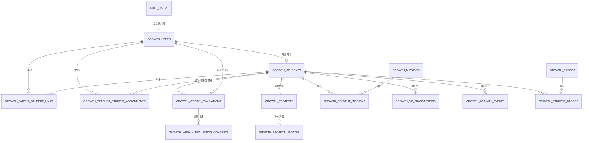

# Growth 2.0 테스트 백엔드 설계도

> 상태: 설계 후보. 아직 데이터베이스를 만들거나 연결하지 않았습니다.
>
> 대상: Growth 2.0 미리보기만을 위한 독립 테스트 환경

## 1. 한눈에 보는 추천안

Growth 2.0은 기존 코딩쏙 운영 데이터베이스와 연결하지 않고, **완전히 비어 있는 별도 Supabase 프로젝트 또는 별도 로컬 Supabase 프로젝트**에서 시작합니다.

초기 MVP에는 다음 구성을 추천합니다.

- 별도 프로젝트의 `public` 스키마 사용
- 모든 표 이름을 `growth_`로 시작
- Supabase Auth의 가상 계정만 사용
- 모든 표에 RLS(행 단위 출입문) 적용
- 실제 개인정보 대신 `테스트학생1`, `테스트학부모1` 같은 가상 데이터만 사용
- migration은 기존 이력과 무관하게 `0001`부터 시작
- 화면은 데이터 복사본이 아니라 하나의 원본 기록을 역할별로 다르게 읽음

쉽게 말하면, 운영 학원 장부 옆에 연습장을 덧붙이는 방식이 아닙니다. **별도의 빈 연습용 장부를 새로 만들고, Growth 2.0 자료만 적는 방식**입니다.

## 2. 기존 운영 DB와 분리하는 이유

기존 migration 이력에는 운영 DB의 시작 상태를 완전히 재현하기 어려운 문제가 있습니다. 그 상태에서 새 기능을 얹으면 다음 위험이 생깁니다.

- 개발자 PC마다 표 구성이 달라질 수 있음
- 기존 `profiles`, `students`, `homework`가 있다고 잘못 가정할 수 있음
- 테스트 중 운영 자료를 건드릴 가능성이 생김
- 오류가 Growth 2.0 때문인지 기존 이력 때문인지 구분하기 어려움

따라서 Growth 2.0 테스트 백엔드는 다음을 전제로 하지 않습니다.

- 기존 `profiles` 표
- 기존 `students` 표
- 기존 과제·출결·리포트 표
- 운영 계정과 운영 UUID
- 운영 Supabase URL이나 비밀키

나중에 운영 시스템과 연결할 때는 별도의 “통합 설계”와 데이터 이관 검증을 먼저 진행합니다.

## 3. Supabase 구성 A와 B 비교

| 비교 항목 | A. 별도 프로젝트 `public` + `growth_*` | B. 별도 프로젝트 `growth_v2` 스키마 |
|---|---|---|
| 운영 DB와 분리 | 별도 프로젝트이므로 완전 분리 | 별도 프로젝트이므로 완전 분리 |
| 표 구분 | 이름만 봐도 `growth_`로 구분 | 스키마 이름으로 구분 |
| Supabase Auth 연결 | 가장 단순함 | 가능하지만 추가 설정 필요 |
| 자동 REST API | 기본 설정과 잘 맞음 | Exposed schemas 추가 필요 |
| Supabase 클라이언트 | 보통 방식 그대로 사용 | 매 요청에 스키마 지정 또는 기본 스키마 설정 필요 |
| RLS 작성 | 자료와 예시가 많고 단순함 | 가능하지만 권한·스키마 사용 권한까지 함께 관리 |
| 설정 실수 가능성 | 낮음 | 상대적으로 높음 |
| 장기 분리 수준 | 표 이름으로 충분히 구분 | 내부 구조를 더 강하게 구분 가능 |

### MVP 추천: A

초기 MVP에는 **A 방식**을 추천합니다.

이유는 별도 프로젝트 자체가 이미 가장 큰 분리벽이기 때문입니다. 여기에 `growth_` 접두어를 붙이면 표의 목적도 분명합니다. 별도 스키마는 좋은 구조이지만, Data API에 스키마를 노출하고 권한을 추가하며 클라이언트가 스키마를 정확히 선택해야 합니다. 지금 단계에서는 얻는 이점보다 설정 항목이 더 많습니다.

다만 RLS 확인을 돕는 내부 함수는 Data API에 노출하지 않는 `private` 스키마에 둡니다. 사용자 화면이 읽는 실제 표는 `public.growth_*`에 두고, 출입문 판단 도구만 잠긴 내부 서랍에 두는 구성입니다.

장기적으로 API 표면을 더 엄격히 분리해야 한다면, 별도 `api` 스키마와 내부 스키마를 나누는 B 계열 구조를 다시 검토합니다.

공식 참고:

- [Supabase custom schema 사용](https://supabase.com/docs/guides/api/using-custom-schemas)
- [Supabase Data API 보안](https://supabase.com/docs/guides/api/securing-your-api)
- [Supabase RLS 안내](https://supabase.com/docs/guides/database/postgres/row-level-security)

## 4. 현재 화면에서 저장이 필요한 정보

### 학생 화면

- 학생 표시 이름
- 미션 목록과 보상 XP
- 학생별 미션 배정·완료 상태
- XP 거래 내역과 합계
- XP 합계로 계산한 레벨과 다음 레벨까지 남은 XP
- 연속 학습일 계산에 쓰는 활동 시각
- 공개된 선생님 평가 중 잘한 점과 다음 목표
- 배운 개념
- 프로젝트 이름, 진행률, 최근 작업
- 성장 타임라인 이벤트
- 획득 배지

### 학부모 화면

- 연결된 자녀
- 해당 주의 출석 스냅샷
- 과제 완료율 스냅샷
- 주간 목표 진행률 스냅샷
- 프로젝트 진행률 스냅샷
- 공개된 잘한 점, 보완할 점, 다음 수업 목표
- 공개된 배운 개념
- 프로젝트 최근·다음 작업
- 해당 주 성장 이벤트
- 학부모 대화 제안

### 선생님 화면

- 담당 학생 관계
- 평가 대상 주
- 이해도, 참여 모습, 과제 상태
- 배운 개념
- 잘한 점, 보완할 점, 다음 수업 목표
- 프로젝트 최근·다음 작업과 진행률
- `draft` 초안 상태
- `published` 공개 상태
- 작성자, 수정자, 공개자와 시각
- 공개 후 수정 이력

현재 React 임시 상태의 `draft`와 `published` 구분은 실제 백엔드에서도 유지합니다. 다만 실제 DB에서는 새로고침 후에도 남고, 로그인 권한으로 보호되며, 공개 버전의 과거 기록도 보존됩니다.

## 5. 단일 원본 원칙

같은 문장을 학생용, 학부모용, 선생님용 표에 각각 복사하지 않습니다.

| 화면에 보이는 내용 | 원본 |
|---|---|
| 학생 피드백·다음 목표 | 공개된 `growth_weekly_evaluations` |
| 학부모 잘한 점·보완할 점·다음 목표 | 같은 공개 평가 |
| 학생 총 XP | `growth_xp_transactions.amount` 합계 |
| 미션 완료 상태 | `growth_student_missions` 완료 기록 |
| 성장 타임라인 | `growth_activity_events` |
| 프로젝트 최근 작업·진행률 | 최신 `growth_project_updates` |
| 학생 배지 | `growth_student_badges` |
| 평가에서 배운 개념 | `growth_weekly_evaluation_concepts` |

화면마다 문장 표현이 조금 달라야 할 때는 원본을 복사 저장하지 않고 API가 역할에 맞게 선택합니다.

- 학생: 잘한 점과 다음 목표 중심
- 학부모: 잘한 점, 보완할 점, 다음 목표 전체
- 선생님: 초안과 공개본, 이해도 등 전체

주간 퍼센트는 공개 당시 숫자가 나중에 바뀌지 않도록 평가 공개본에 스냅샷으로 저장합니다. 이것은 무의미한 중복이 아니라 “그 주에 학부모에게 실제로 보여 준 성적표”를 보존하기 위한 기록입니다.

## 6. 최소 테이블

| 테이블 | 목적 | 중요한 원칙 |
|---|---|---|
| `growth_users` | Auth 계정과 학생·학부모·선생님·관리자 역할 연결 | 역할은 사용자 요청 문자열이 아니라 DB 기록으로 판단 |
| `growth_students` | 학생용 내부 식별자와 활성 상태 | 표시 이름은 연결된 사용자 정보에서 읽음 |
| `growth_parent_student_links` | 학부모와 자녀 연결 | 활성 연결만 접근 허용 |
| `growth_teacher_student_assignments` | 선생님과 담당 학생 연결 | 활성 배정 기간 확인 |
| `growth_weekly_evaluations` | 선생님 주간 평가와 공개 스냅샷 | 학생·주·버전별 보존 |
| `growth_weekly_evaluation_concepts` | 해당 평가에서 배운 개념 | 평가와 함께 공개됨 |
| `growth_projects` | 학생 프로젝트 기본 정보 | 삭제 대신 비활성 |
| `growth_project_updates` | 최근 작업, 다음 작업, 진행률의 원본 | 최신 기록이 화면에 표시됨 |
| `growth_missions` | 미션 제목, 설명, XP 보상 규칙 | 삭제 대신 비활성 |
| `growth_student_missions` | 학생별 미션 배정·완료 | 같은 배정의 중복 완료 차단 |
| `growth_xp_transactions` | XP 지급 장부 | 합계 필드 없이 거래 내역 합산 |
| `growth_activity_events` | 성장 타임라인 원본 | 같은 사건의 중복 생성 차단 |
| `growth_badges` | 배지 정의 | 코드값은 고유 |
| `growth_student_badges` | 학생이 획득한 배지 | 같은 배지 중복 획득 차단 |

초기 MVP에서 레벨 구간은 버전 관리되는 서버 설정으로 계산합니다. 원장님이 레벨 기준을 자주 바꾸는 운영이 확정되면 `growth_level_rules` 표를 후속 migration에 추가합니다. 아직 운영 규칙이 정해지지 않았으므로 후보 SQL에서 미리 추측하지 않습니다.

## 7. 주요 관계

쉬운 설명:

- 로그인 계정 하나는 한 역할을 가집니다.
- 학생은 학부모 여러 명과 연결될 수 있고, 학부모도 자녀 여러 명과 연결될 수 있습니다.
- 선생님은 담당 관계가 활성인 학생만 다룹니다.
- 선생님 평가 한 건이 학생 피드백과 학부모 리포트의 공통 원본입니다.
- 미션 완료, XP 지급, 타임라인 이벤트는 서로 연결되지만 각자 역할이 다른 장부입니다.

## 8. 주간 평가와 버전

### 상태

- `draft`: 선생님 작성 중. 학생·학부모에게 보이지 않음
- `published`: 공개 중인 현재 버전. 학생·학부모에게 보임
- `archived`: 새 버전 공개 후 보관된 과거 버전

`ready` 상태는 초기 MVP에서는 사용하지 않습니다. 원장 승인 절차가 확정되면 `ready`를 후속 단계에서 추가합니다.

### 중복 방지

- 같은 학생·같은 주에 활성 초안은 최대 1개
- 같은 학생·같은 주에 현재 공개본은 최대 1개
- 같은 학생·같은 주·같은 버전 번호는 최대 1개

### 공개 후 수정

공개본 문장을 직접 덮어쓰지 않습니다.

1. 기존 공개본을 바탕으로 새 `draft` 생성
2. `version`을 1 증가
3. 수정 후 공개
4. 이전 공개본은 `archived`로 보존

이 방식이면 “지난주에 실제로 무엇을 보여 줬는지”를 나중에도 확인할 수 있습니다.

### 공개 주체 추천

초기 테스트에서는 **담당 선생님이 공개 버튼을 누르는 방식**을 추천합니다. 원장 승인 흐름은 운영 부담과 책임 범위를 원장님이 결정한 뒤 추가합니다.

## 9. 출석·과제·진행률 저장 방식

### A. 실제 활동에서 매번 계산

장점:

- 항상 최신 숫자
- 원본 활동과 일치

단점:

- 출결, 과제, 목표 기록 표가 모두 먼저 필요
- 과거 리포트 숫자가 나중 수정 때문에 달라질 수 있음

### B. 공개 시 확정값을 스냅샷 저장

장점:

- 현재 미리보기 구조와 잘 맞음
- 학부모에게 보여 준 당시 숫자가 보존됨
- 초기 MVP를 작게 시작할 수 있음

단점:

- 원본 활동 기록과 자동 대조할 수 없음
- 선생님 또는 서버가 확정값을 넣어야 함

### 추천

- 초기 MVP: B 방식
- 장기 운영: A로 계산한 뒤, 공개 순간 B로 고정하는 혼합 방식

후보 SQL은 초기 MVP에 맞춰 평가 공개본에 출석 횟수와 세 가지 진행률 스냅샷을 둡니다.

## 10. XP·미션·타임라인 관계

미션 완료 요청 한 번은 안전한 서버 작업에서 하나의 묶음으로 처리합니다.

1. `growth_student_missions` 완료 처리
2. `growth_xp_transactions` XP 지급
3. `growth_activity_events` 타임라인 기록
4. 조건을 만족하면 `growth_student_badges` 배지 지급

중간에 하나라도 실패하면 전체를 취소합니다. 같은 요청이 다시 와도 고유 키 때문에 XP와 이벤트가 두 번 생기지 않습니다.

학생 총 XP는 별도 합계 칸을 직접 올리지 않고 다음처럼 계산합니다.

`총 XP = 해당 학생의 유효한 growth_xp_transactions.amount 합계`

초기 MVP에서는 XP 0 또는 음수를 금지합니다. 잘못 지급한 XP를 되돌리는 운영 규칙은 관리자 승인 방식이 정해진 뒤 별도 보정 거래 설계로 추가합니다.

## 11. 데이터 안전장치

- 주요 ID는 UUID
- 모든 주요 표에 `created_at`, `updated_at`
- 작성자와 최종 수정자 기록
- 실제 삭제 대신 `is_active`, `archived_at` 우선
- XP에 학생별 `idempotency_key` 고유 제약
- 미션에 학생·미션·배정키 고유 제약
- 활동 이벤트에 학생별 `event_key` 고유 제약
- 프로젝트 진행률 0~100 제약
- 주간 평가 주간은 7일 제약
- 공개본은 직접 내용 수정 금지
- 연결 관계는 활성 여부와 유효 기간 확인
- 일반 학생·학부모는 XP 삽입 불가
- 로그에는 UUID 일부나 내부 요청 번호만 남기고 이름·연락처·평가 문장 제외

## 12. 데이터 보존 원칙

- 평가: 버전 보존
- XP: 거래 행을 삭제하거나 수정하지 않음
- 활동 이벤트: 삭제하지 않고 필요 시 보관 상태 추가
- 연결 관계: 삭제 대신 비활성과 종료일 기록
- 미션·배지·프로젝트: 삭제 대신 비활성
- 테스트 초기화: 운영 방식의 삭제가 아니라 독립 테스트 프로젝트를 재생성하거나 가상 seed만 재적용

## 13. 운영 연결 전 반드시 확인할 사항

1. 실제 학생 계정 생성·동의 절차
2. 학부모와 자녀 연결을 누가 승인하는지
3. 선생님 담당 학생 배정 책임자
4. 평가 공개 승인 방식
5. XP 보정·취소 규칙
6. 개인정보 보관 기간과 삭제 요청 처리
7. 운영 DB의 실제 ID와 Growth 2.0 ID 연결 방법
8. 백업, 복원, 감사 로그 정책
9. 실제 RLS 통합 테스트 통과
10. 원장님 승인 후에만 운영 연결

이 확인 전에는 운영 데이터베이스와 연결하지 않습니다.
